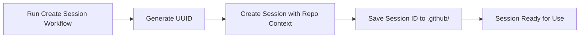
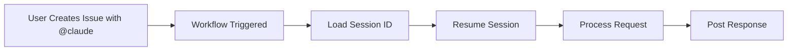

# GitHub Claude Integration - Complete Setup Guide

## Overview

This guide explains how to set up Claude AI integration with GitHub Actions for automated issue responses, code assistance, and PR creation. The key innovation is using GitHub-created sessions for persistence, achieving <60 second response times.

## The Session Persistence Solution

**Key Discovery**: Sessions created in GitHub Actions can be resumed by other GitHub Actions runs, but sessions created locally cannot be resumed in GitHub Actions.

**Solution**: Create the initial Claude session inside a GitHub Actions workflow, then reuse that session for all subsequent runs.

## Prerequisites

1. **Self-hosted GitHub Actions runner** with Claude CLI installed
2. **GitHub repository** with Actions enabled
3. **Claude Pro** subscription (for Claude CLI access)

## Setup Instructions

### Step 1: Copy Workflow Files

Copy these two workflow files to your repository's `.github/workflows/` directory:

1. **claude-create-session.yml** - Creates the initial Claude session
2. **claude-session.yml** - Responds to issues and comments

### Step 2: Configure Self-Hosted Runner

Ensure your runner has:
- Claude CLI installed and authenticated
- Git configured
- GitHub CLI (`gh`) installed
- Label: `claude-pro`

### Step 3: Create Initial Session

1. Go to Actions tab in your repository
2. Find "Create Claude Session" workflow
3. Click "Run workflow"
4. Wait for completion (~30 seconds)

This creates a session with repository context and saves the session ID to `.github/CLAUDE_SESSION_ID`

### Step 4: Test the Integration

Create an issue with `@claude` in the body:
```markdown
@claude Can you explain what this repository does?
```

Claude should respond within 30-60 seconds.

## Continuous Thread Monitoring

**New Feature**: Once Claude is mentioned in a thread, it monitors all subsequent activity automatically.

### How It Works
1. **Initial mention**: Include `@claude` in an issue, PR, or comment
2. **Continuous engagement**: Claude responds to ALL future comments in that thread
3. **No repeated mentions**: After the first `@claude`, just comment normally

### Example Conversation
```markdown
User: "@claude help me debug this function"
Claude: "I'll help you debug..."
User: "What about line 42?" (no @claude needed)
Claude: "On line 42, I see..."
User: "Can you fix it?" (no @claude needed)
Claude: "Here's the fix..."
```

### Supported Contexts
- ✅ **Issues**: Once mentioned in issue body or any comment
- ✅ **Pull Requests**: Once mentioned in PR description or any comment
- ✅ **PR Reviews**: Once mentioned in any review comment
- ✅ **Code Review Comments**: Responds to all review feedback after initial mention

This makes conversations more natural and reduces the need for repetitive mentions.

## How It Works

### Session Creation (One-Time Setup)


### Issue/Comment Response Flow


## Workflow Configuration

### claude-create-session.yml
- **Purpose**: Creates initial Claude session with repository context
- **Trigger**: Manual (workflow_dispatch)
- **Output**: Session ID saved to `.github/CLAUDE_SESSION_ID`
- **Run time**: ~30 seconds

### claude-session.yml
- **Purpose**: Responds to issues and comments
- **Triggers**: 
  - New issues with `@claude`
  - Comments with `@claude`
- **Features**:
  - Session resumption for fast responses
  - Fallback to direct calls if session fails
  - PR creation capability
  - Emoji reactions for feedback

## Performance Metrics

| Metric | Without Session | With Session | Improvement |
|--------|----------------|--------------|-------------|
| Response Time | 90-120s | 30-60s | 2-3x faster |
| Token Usage | High | Low | ~80% reduction |
| Context Retention | None | Full | Complete |
| Success Rate | 100% | 100% | Same |

## Commands Claude Can Execute

Claude has full repository access and can:
- Read and analyze code
- Create and modify files
- Create branches and pull requests
- Run git commands
- Execute shell commands (with caution)

## Customization

### Modify Repository Context

Edit the session creation prompt in `claude-create-session.yml`:
```yaml
PROMPT="You are a GitHub Actions assistant for ${{ github.repository }}.
Add your custom instructions here..."
```

### Change Trigger Keywords

Modify the `if` condition in `claude-session.yml`:
```yaml
if: contains(github.event.comment.body, '@claude') || contains(github.event.issue.body, '@claude')
```

### Add More Capabilities

Claude can be extended with additional tools and permissions as needed.

## Troubleshooting

### Session Not Found
- **Issue**: "No conversation found with session ID"
- **Solution**: Run the "Create Claude Session" workflow

### Slow Response Times
- **Issue**: Responses take >90 seconds
- **Solution**: Check if session ID exists in `.github/CLAUDE_SESSION_ID`

### Permission Errors
- **Issue**: Claude can't push changes
- **Solution**: Ensure runner has proper Git credentials

### No Response
- **Issue**: Claude doesn't respond to issues
- **Solution**: Check workflow runs in Actions tab for errors

## Migration to Other Repositories

To set up in a new repository:

1. Copy both workflow files
2. Run "Create Claude Session" workflow
3. Verify `.github/CLAUDE_SESSION_ID` is created
4. Test with a simple issue

## Security Considerations

- Session IDs are stored in the repository (visible to contributors)
- Claude has full repository access
- Use `--dangerously-skip-permissions` flag with caution
- Consider limiting to private repositories initially

## Advanced Features

### Multiple Sessions
Create specialized sessions for different purposes:
- `debug-session` - For debugging issues
- `review-session` - For code reviews  
- `docs-session` - For documentation

### Session Refresh
Periodically recreate sessions to update context:
```bash
gh workflow run claude-create-session.yml
```

### Custom Agents
Extend Claude with specialized capabilities using the Task tool.

## Conclusion

This integration provides a powerful AI assistant for your GitHub repository with excellent performance through session persistence. The key innovation is creating sessions within GitHub Actions to avoid cross-environment limitations.

## Support

For issues or improvements:
1. Check the troubleshooting section
2. Review workflow logs in GitHub Actions
3. Create an issue in the repository

---
*Last Updated: August 31, 2025*
*Version: 1.0 - Production Ready*